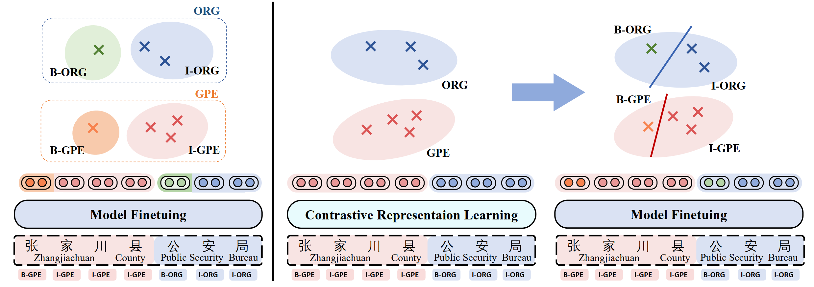
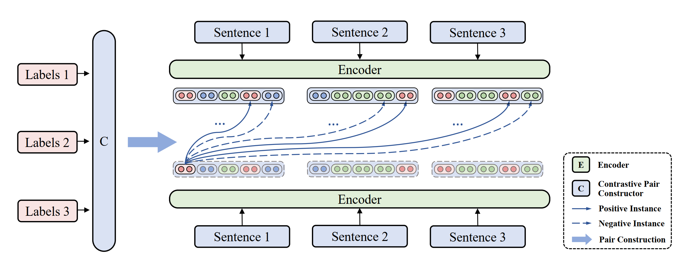

# NerCo: A Contrastive Learning based Two-stage Chinese NER Method  

This repo provides the source codes & data for our paper "NerCo: A Contrastive Learning based Two-stage Chinese NER Method  " .

### Overview

NerCo is our proposed two-stage learning approach for tackling *Entity Representation Segmentation in Label-semantics*. Unlike traditional sequence labeling methods which lead to the above problem, our approach takes a two-stage NER strategy. In the first stage, we conduct contrastive learning for label-semantics based representations. Then we finetune the learned model in the second stage, equipping it with inner-entity position discrimination for chunk tags and linear mapping to type tags for each token. 
Our codes are modified from the baseline [Flat](https://github.com/LeeSureman/Flat-Lattice-Transformer/tree/master), so we recommend that you read their codes in advance to better understand ours. And we conducted our experiments on a NVIDIA A100 80G GPU for training.


<p align="center">
    Figure1: A comparison between traditional sequence labeling methods and our proposed method NerCo. 
</p>



<p align="center">
    Figure2: Contrastive representation learning as the first stage of NerCo.  
</p>

## Dependencies

```bash
source activate # use conda
conda create --name nerco python=3.7.3 # create a virtual enviroment named nerco
conda activate nerco # activate
pip3 install torch==1.8.2+cu111 torchvision==0.9.2+cu111 torchaudio==0.8.2 -f https://download.pytorch.org/whl/lts/1.8/torch_lts.html # torch
pip3 install -r requirements.txt # requirement file
cp fastnlp_src/* ~/.conda/envs/nerco/lib/python3.7/site-packages/fastNLP/core/. # overwrite fastnlp source
```

## Data Preparation
1. Download the character embeddings and word embeddings(Provided by [Flat](https://github.com/LeeSureman/Flat-Lattice-Transformer/blob/master/README.md)). Put them into `data/word` subdirectory.

      Character and Bigram embeddings (gigaword_chn.all.a2b.{'uni' or 'bi'}.ite50.vec) : [Google Drive](https://drive.google.com/file/d/1_Zlf0OAZKVdydk7loUpkzD2KPEotUE8u/view?usp=sharing) or [Baidu Pan](https://pan.baidu.com/s/1pLO6T9D)

      Word(Lattice) embeddings: 
      
      yj, (ctb.50d.vec) : [Google Drive](https://drive.google.com/file/d/1K_lG3FlXTgOOf8aQ4brR9g3R40qi1Chv/view?usp=sharing) or [Baidu Pan](https://pan.baidu.com/s/1pLO6T9D)
      
      ls, (sgns.merge.word.bz2) : [Baidu Pan](https://pan.baidu.com/s/1luy-GlTdqqvJ3j-A4FcIOw)

- Preprocess and merge the lexicon file and the char file into a mixed char_and_word file.
```bash
cd data
python preprocess.py
```

&nbsp;2.&nbsp; Datasets.

Download the datasets [here](https://drive.google.com/drive/folders/1efbRAjqIRe5y1meiNEZdR4EzRmY7tOM0?usp=sharing) (with MSRA train/test splits preprocessed). For Ontonotes, you could download the [dataset](https://catalog.ldc.upenn.edu/LDC2011T03) and also preprocess the train split. (Due to copyright and permission reasons, we are unable to post our processed Ontonotes dataset.) See [Flat](https://github.com/LeeSureman/Flat-Lattice-Transformer/blob/master/README.md) for more details of preprocessing MSRA and Ontonotes.
Put each dataset into `data/datasets/dataName`(e.g. `data/datasets/weibo` for Weibo NER dataset).

## Evaluate
You can evaluate our trained checkpoints(download [here](https://drive.google.com/drive/folders/17PD3q4Hl77DKq0PjfQp4gmH2715hWZJF?usp=sharing)).
Put each dataset checkpoint into `checkpoints/dataName` and directly execute the following commands:
```bash
cd evaluate
python weibo.py #taking weibo dataset for evaluation example
```

Or you can train the models from scratch(see next section) and modify the corresponding model path in the `python` scripts for evaluation.

## Train

```bash
cd train
python weibo.py #taking weibo for training example
```

Model Performance:

|  Datasets | Resume|Weibo| MSRA| Ontonotes|
| :----:  | :----:  | :----:  |  :----:  |  :----:  |
|Test F1| 0.968196   | 0.727924  |0.962927|0.836158|
